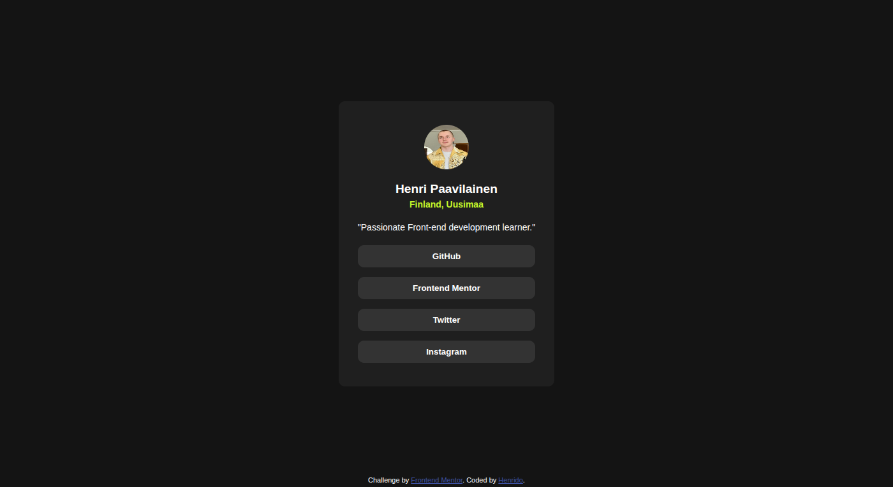

# Frontend Mentor - Social links profile solution

This is a solution to the [Social links profile challenge on Frontend Mentor](https://www.frontendmentor.io/challenges/social-links-profile-UG32l9m6dQ). Frontend Mentor challenges help you improve your coding skills by building realistic projects. 

## Table of contents

- [Overview](#overview)
  - [The challenge](#the-challenge)
  - [Screenshot](#screenshot)
  - [Links](#links)
- [My process](#my-process)
  - [Built with](#built-with)
  - [What I learned](#what-i-learned)
  - [Continued development](#continued-development)
  - [Useful resources](#useful-resources)
- [Author](#author)
- [Acknowledgments](#acknowledgments)

## Overview

Social links profile solution to the challenge from Frontend Mentor!
Had much fun with this challenge, made some improvements on custom properties compered to my last challenges!

### The challenge

Users should be able to:

- See hover and focus states for all interactive elements on the page

### Screenshot

### Links

- Solution URL: [Add solution URL here](https://github.com/Henrido-cpu/social-links-profile)
- Live Site URL: [Add live site URL here](https://henrido-cpu.github.io/social-links-profile/)

## My process

Step 1: I started by inspecting the design picture and thought of a plan to use with how im gonna layout the HTML and CSS.

Step 2: With a plan in mind i started laying out the HTML with containers and classes for the elements in need. I decided to go with flexbox for the layout.

Step 3: With the HTML done i opened the CSS file and started working on the visual layout of elements using flexbox. With that out of the way i focused on individual elements and styles such as font sizes and text color.

Step 4: Lastly with CSS i added interactivity for the buttons with pseudoclasses and anchor tags. That's it!

### Built with

- HTML5
- CSS custom properties
- Flexbox

### What I learned

I learned from my previous mistakes and used custom properties in CSS for this project and it made the whole challenge SO much easier. That was one major thing this challenge taught me.

### Continued development

I would like to learn more about focused states and styling them. That is definitely one thing i need improvement on and i want to start improving my sites overall accessibility, so that all kind of users can access them.

## Author

- Github - [@Henrido-cpu](https://github.com/Henrido-cpu)
- Frontend Mentor - [@Henrido-cpu](https://www.frontendmentor.io/profile/Henrido-cpu)
- Twitter - [@HenridoWeb](https://x.com/HenridoWeb)
- Instagram - [@henridoweb](https://www.instagram.com/henridoweb/)

